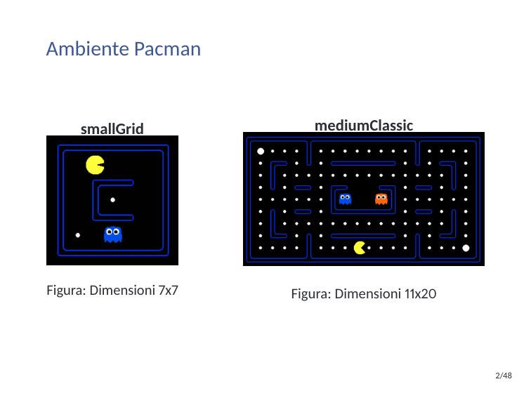

# Applied Reinforcement Learning for Pac-Man Agents

This repository presents a comparative Reinforcement Learning study on autonomous Pac-Man agents, focused on two complementary paradigms:

- **Model-Based RL:** Value Iteration
- **Model-Free RL:** Q-Learning (tabular and approximate variants)

The project combines algorithm implementation, parameter tuning, and quantitative analysis across different map complexities.



## At a Glance

- **Algorithms compared:** Value Iteration vs Q-Learning
- **Evaluation target:** win rate and behavioral robustness under stochastic dynamics
- **Map complexity gap observed:** **58% win rate** on `smallGrid` vs **34%** on `mediumClassic`
- **Key tuning insights:**
    - optimal discount factor shifts from **0.6** (`smallGrid`) to **0.8** (`mediumClassic`)
    - optimal safety distance increases from **1** to **3** as environment complexity grows
    - Ghostbuster mode showed limited impact in the tested setup

## Problem Statement

Pac-Man is a stochastic, non-stationary environment with competing objectives:

- maximize score,
- avoid ghosts,
- complete episodes efficiently.

The goal was to build and evaluate agents that can learn or plan robust strategies under these constraints, and to understand when a model-based approach is preferable versus a model-free one.

## Implemented Approaches

### Value Iteration (Model-Based)

The Value Iteration agent models the environment as an MDP and computes a policy through Bellman updates.

To make this practical for Pac-Man, the implementation includes:

- dynamic reward updates for non-stationary threats,
- danger-zone handling around ghost trajectories,
- optional Ghostbuster behavior when capsules are active,
- configurable convergence threshold and maximum iterations.

Core implementation files:

- `reinforcement/myValueIterationAgents.py`
- `reinforcement/valueIterationAgents.py`

### Q-Learning (Model-Free)

The Q-Learning agent learns action values directly from interaction via temporal-difference updates with exploration/exploitation balancing.

Implemented variants:

- tabular Q-Learning (`PacmanQAgent`)
- Approximate Q-Learning (`ApproximateQAgent`)

Core implementation file:

- `reinforcement/qlearningAgents.py`

## Experimental Analysis

The study investigates how hyperparameters affect performance across maps of different complexity (`smallGrid` and `mediumClassic`).

Primary factors analyzed:

- discount factor ($\gamma$),
- ghost safety distance,
- reward shaping terms (food, ghosts, capsules, danger zones),
- Ghostbuster mode toggle.

### Discount Factor: Mathematical Intuition

In Reinforcement Learning, the discount factor $\gamma \in [0,1]$ controls how much future rewards matter in the decision process.

The discounted return is:

$$
G_t = \sum_{k=0}^{\infty} \gamma^k R_{t+k+1}
$$

- If $\gamma$ is close to 0, the agent is short-sighted and prioritizes immediate rewards.
- If $\gamma$ is close to 1, the agent is far-sighted and values long-term reward accumulation.

For Value Iteration, this directly appears in the Bellman optimality update:

$$
V_{k+1}(s) = \max_a \sum_{s'} P(s'\mid s,a)\left[R(s,a,s') + \gamma V_k(s')\right]
$$

For Q-Learning, $\gamma$ appears in the temporal-difference target:

$$
Q(s,a) \leftarrow Q(s,a) + \alpha\Big(r + \gamma \max_{a'}Q(s',a') - Q(s,a)\Big)
$$

This is why tuning $\gamma$ produced different optimal settings for `smallGrid` and `mediumClassic` in this project.

### Key Findings

- **Environment complexity matters:** performance drops significantly on larger, denser maps.
- **Discount factor is context-dependent:** a moderate $\gamma$ works better on simpler maps, while higher discounting is more effective in complex environments.
- **Safety behavior scales with complexity:** larger maps benefited from a larger safety radius around ghosts.
- **Model-free adaptability:** Q-Learning showed stronger adaptation in non-stationary conditions.
- **Model-based reliability:** Value Iteration remained predictable and stable when transition/reward modeling was accurate.

## Visual Results

Parameter sweeps and comparative plots used in the analysis:

### Discount Factor Analysis


### Safety Distance and Ghostbuster Analysis


### Summary Tables

#### Optimal Configuration by Map Complexity

| Metric | smallGrid | mediumClassic |
| --- | --- | --- |
| Discount factor | 0.6 | 0.8 |
| Safety distance | 1 | 3 |
| Ghostbuster mode | Low impact | Low impact |
| Win rate | 58% | 34% |

#### Comparative Performance Snapshot

| Dimension | Value Iteration | Q-Learning |
| --- | --- | --- |
| Learning style | Model-based planning | Model-free online learning |
| Adaptability in non-stationary dynamics | Moderate | High |
| Dependence on environment model | High | None |
| Parameter sensitivity | High | High |
| Best use case in this project | Stable modeled scenarios | Dynamic gameplay adaptation |

Raw plot files are available in:

- `reinforcement/grafici/discount_factor_small_grid.png`
- `reinforcement/grafici/test02_discount_factor_mediumClassic_img.png`
- `reinforcement/grafici/test_03_safety_distance_smallGrid.png`
- `reinforcement/grafici/test_04_safety_distance_and_ghostbuster_mode_mediumClassic.png`

## Project Structure

- `reinforcement/`: Pac-Man RL environment, agents, scripts, and generated metrics
- `markov/`: supporting Markov-process experiments/utilities
- `presentazione-RL-Pacman.pdf`: project presentation
- `relazione_RL_Pacman.pdf`: full technical report

## How to Run

From `reinforcement/`:

Run a Value Iteration-based Pac-Man agent:

```bash
python pacman.py -p MDPAgent -l smallGrid -n 100 -q
```

Run Q-Learning training and evaluation:

```bash
python pacman.py -p PacmanQAgent -x 2000 -n 2010 -l smallGrid
```

Run Berkeley-compatible reinforcement tests/autograder flow:

```bash
python autograder.py
```

## Documentation

- [Full Technical Report](./relazione_RL_Pacman.pdf)
- [Presentation Slides](./presentazione-RL-Pacman.pdf)
